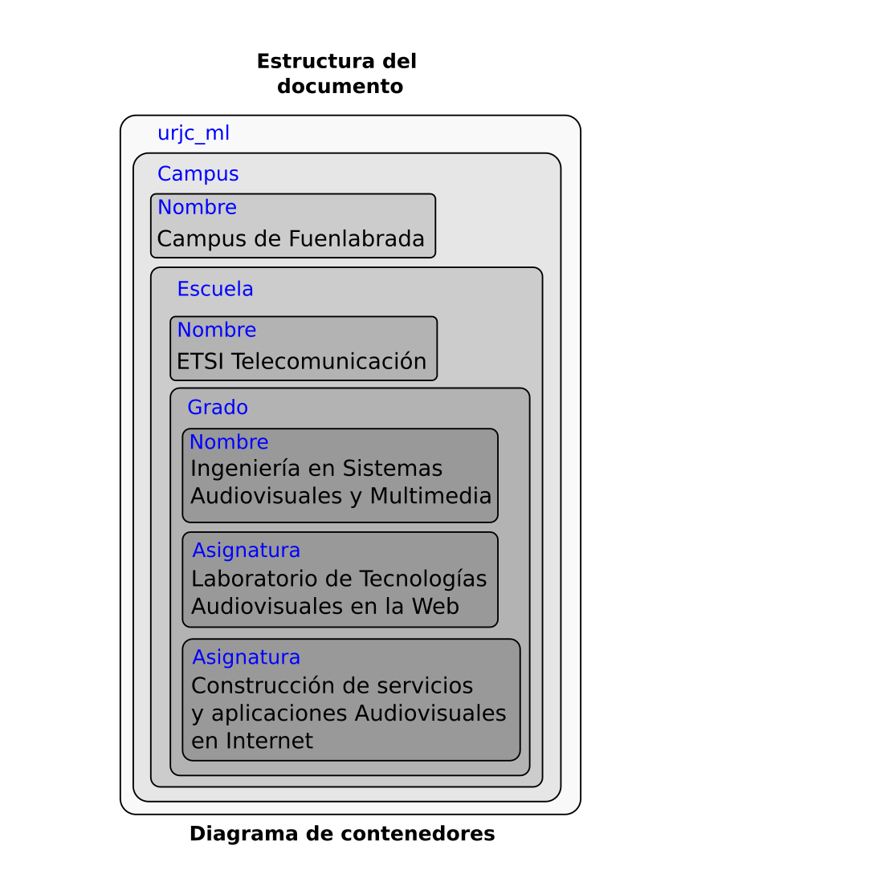
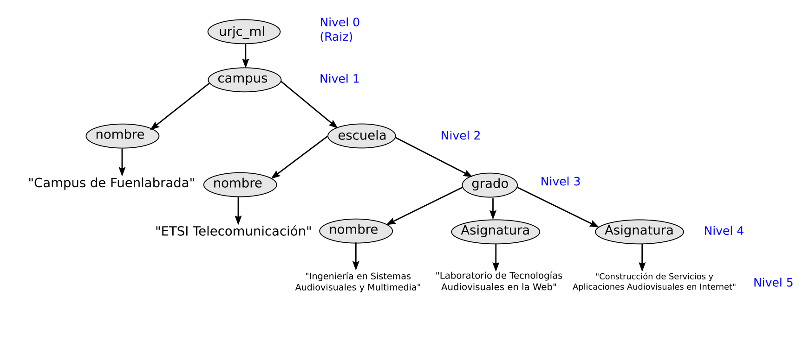

# Ejercicio 1

```html
<!DOCTYPE urjc_ML SYSTEM "urjc_ml.dtd">
<urjc_ml>
  <!-- include URL URJC -->
  <campus>
    <nombre>Campus de Fuenlabrada</nombre>
    <escuela>
      <nombre>ETSI Telecomunicación</nombre>
      <grado>
        <nombre>Ingeniería en Sistemas Audiovisuales y Multimedia </nombre>
        <asignatura>Laboratorio de Tecnologias Audiovisuales en la Web</asignatura>
        <asignatura>Construcción de servicios y Aplicaciones Audiovisuales en Internet</asignatura>
      </grado>
    </escuela>
  </campus>
</urjc_ml>
```
----------

**a). Explica para qué sirve la primera línea del documento y por qué es necesaria.**

La primera línea nos indica el tipo de documento. Además la definición del documento se encuentra en el fichero "urjc_ml.dtd" que sirve para saber que etiquetas son válidas y además también nos permitirá corregir posibles errores.

**b). Si se omitiese esta línea, ¿Qué piensas que ocurriría?**

Se produciría un error al no poder analizar correctamente el documento.

**c). Sin conocer el contenido del fichero urjc_ml.dtd, ¿el documento es sintácticamente correcto?**

Sintácticamente es correcto, pues podemos ver que las etiquetas que se abren son cerradas, ahora bien, el nombre de las etiquetas utilizadas pueden ser o no correctas. No es posible saberlo sin conocer el contenido del fichero "urjc_ml.dtd".


**d). ¿Qué hace la tercera línea?**

La tercera línea no hace nada, es simplemente un comentario, solo aporta información para el propietario del archivo o para otros usuarios.

**e). ¿Cuantas etiquetas de apertura hay? ¿Cuantas de cierre?**

Hay 9 etiquetas de apertura. Por tanto habrá también 9 etiquetas de cierre.

**f). Dibuja el diagrama de contenedores de este documento.**




**g). Dibuja la estructura en árbol que define este documento.**

