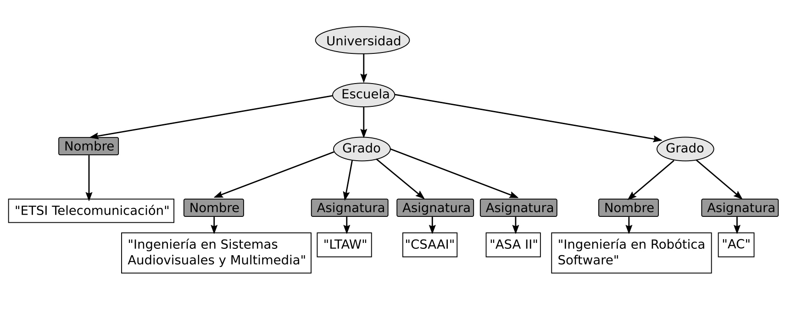

# Ejercicio 2

Este árbol representa la estructura del tipo de documento universidad, que está definido en el archivo llamado universidad.dtd. Los nombres de las etiquetas de cada elemento del árbol están escritos en los nodos. Estos nombres son válidos y se encuentra definidos dentro del documento DTD.


**a). Escribe el documento en SGML que representa esa estructura**

```html
<!DOCTYPE urjc_ML SYSTEM "urjc_ml.dtd">
<Universidad> 
    <Escuela> 
        <Nombre>ETSI Telecomunicación </Nombre>
        <Grado> 
            <Nombre>Ingeniería en Sistemas Audiovisuales y Multimedia</Nombre>
            <Asignatura>LTAW</Asignatura>
            <Asignatura>CSAAI</Asignatura>
            <Asignatura>ASA II</Asignatura>
        </Grado>
        <Grado>
            <Nombre>Ingeniería en Robótica Software</Nombre>
            <Asignatura>AC</Asignatura>
        </Grado>
    </Escuela>
</Universidad>
```

**b) ¿Cuántos elementos contenedores hay? Indica sus nombres**


**c) ¿Cuantos elementos terminales hay? Indica sus valores**


**d) ¿Cuantos elementos hay en el nivel 3?. Escribe sus nombres**