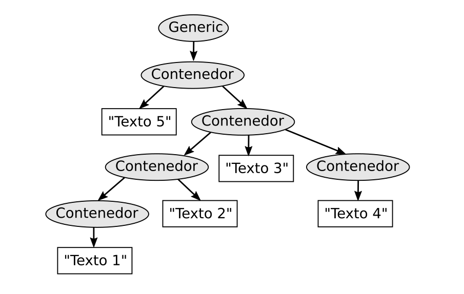

# Ejercicio 3

Este árbol representa la estructura del tipo de documento generic, que está definido en el archivo llamado generic.dtd. Los nombres de las etiquetas de cada elemento del árbol están escritos en los nodos. Estos nombres con válidos y se encuentra definidos dentro del documento DTD

**a) Escribe el documento en SGML que representa esa estructura**

**b) ¿Cuantos elementos hay en total?**

**c) ¿Cuantos elementos terminales hay?. Indica sus valores**

**d) ¿Cuantos elementos no terminales hay?. Indica cuántos hay en cada nivel**

**e) ¿Cuantos elementos hay en el nivel 5?.Indica sus nombres**

